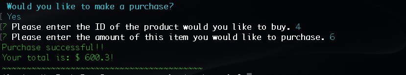
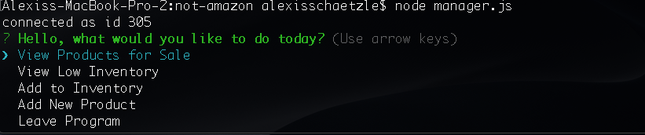
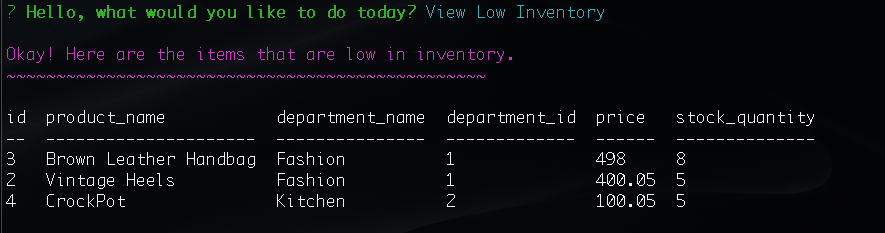
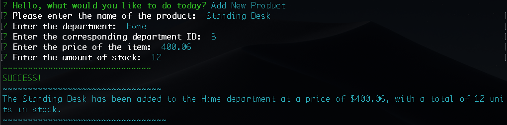

# not-amazon
This is a simple purchasing application.  It has two sides; the customer and the manager.  

Please see the YouTube link for a complete walkthrough of all application functions (sound on): https://youtu.be/M2DW4Cg5G0s 

The customer side of the application allows the customer to:
1) view all current items available for purchase, as well as how many are currently in stock and,
2) purchase items they would like to buy through a series of prompts.

The manager side of the application is much more in depth as it opens with the following menu:
-View Products for Sale
-View Low Inventory
-Add to Inventory
-Add New Product
-End Program

1) If a manager selects View Products for Sale, the app should list every available item: the item IDs, names, prices, and quantities.

2) If a manager selects View Low Inventory, then it should list all items with an inventory count lower than ten.

3) If a manager selects Add to Inventory, your app should display a prompt that will let the manager "add more" of any item currently in the store.

4) If a manager selects Add New Product, it should allow the manager to add a completely new product to the store.

5) Allows the manager to exit out of the program.
